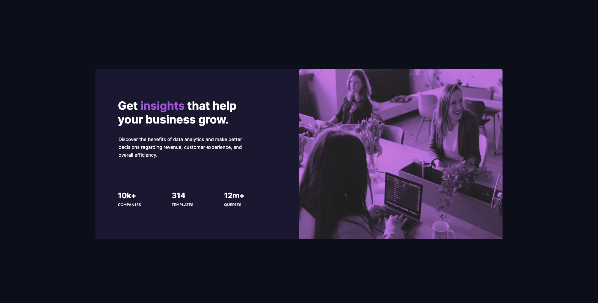

# Frontend Mentor - Stats preview card component solution

This is my solution to the [Stats preview card component challenge on Frontend Mentor](https://www.frontendmentor.io/challenges/stats-preview-card-component-8JqbgoU62).

## Table of contents

- [Overview](#overview)
  - [The challenge](#the-challenge)
  - [Screenshots](#screenshots)
  - [Links](#links)
- [My process](#my-process)
  - [Built with](#built-with)
- [Author](#author)
- [Acknowledgments](#acknowledgments)

## Overview

### The challenge

Users should be able to:

- View the optimal layout depending on their device's screen size

### Screenshots

### Links

- Solution URL: [github](https://github.com/Mabchir/start_preview_card_component)
- Live Site URL: [Netlify](https://nifty-wescoff-f7d79f.netlify.app/)

## My process

### Built with

- HTML
- CSS custom properties
- Flexbox

## Author

- Website - [Mariem Bchir](https://goofy-easley-2c8717.netlify.app/index.html)

- Frontend Mentor - [@Mabchir](https://www.frontendmentor.io/profile/Mabchir)

- Github - [Mabchir](https://github.com/Mabchir)

## Acknowledgments

This is where you can give a hat tip to anyone who helped you out on this project. Perhaps you worked in a team or got some inspiration from someone else's solution. This is the perfect place to give them some credit.

- Frontend Mentor - [@grace-snow](https://www.frontendmentor.io/profile/grace-snow)
- Frontend Mentor - [@TheCoderGuru](https://www.frontendmentor.io/profile/TheCoderGuru)
